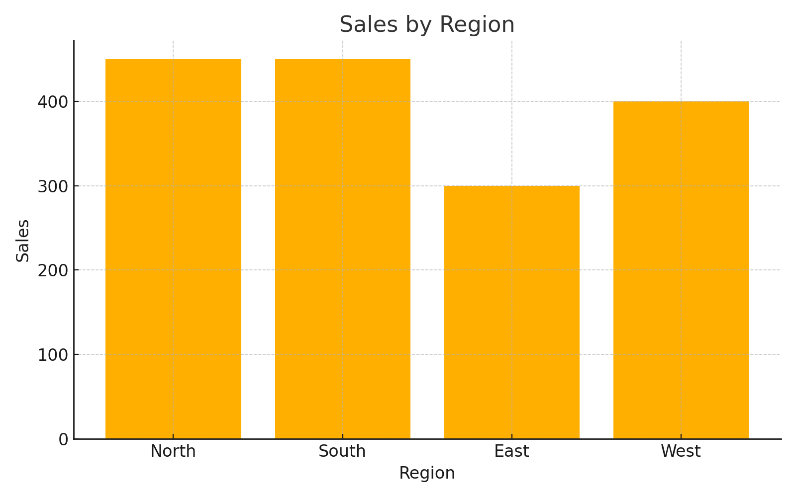
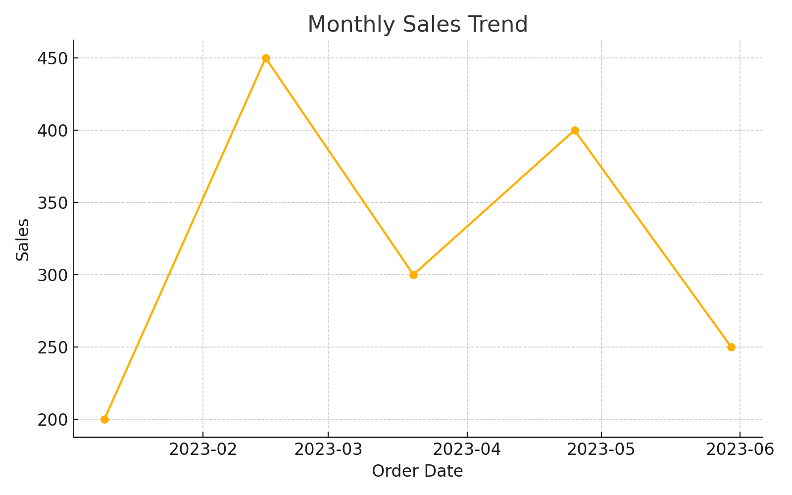

# 📊 Sales Analysis Dashboard

## 🧠 Objective
This project analyzes a small dataset of product sales across different regions. It showcases how to extract insights and build a dashboard using Microsoft Excel.

## 📁 Dataset
Sample data includes:
- Order ID
- Order Date
- Region
- Product
- Sales
- Quantity
- Profit

## 📈 Analysis Performed
- Sales by Region and Product
- Profit Margins
- Quantity Sold
- Monthly Trends

## 📊 Dashboard Features
- Bar chart of region-wise sales
- Line chart of monthly sales trends
- Key metrics: Total Sales, Profit, Quantity

## 📷 Preview

## 🧾 How to Use
1. Download this repository.
2. Open the `Sales_Data.xlsx` file in Microsoft Excel.
3. Navigate to the Dashboard sheet to explore the visuals.
